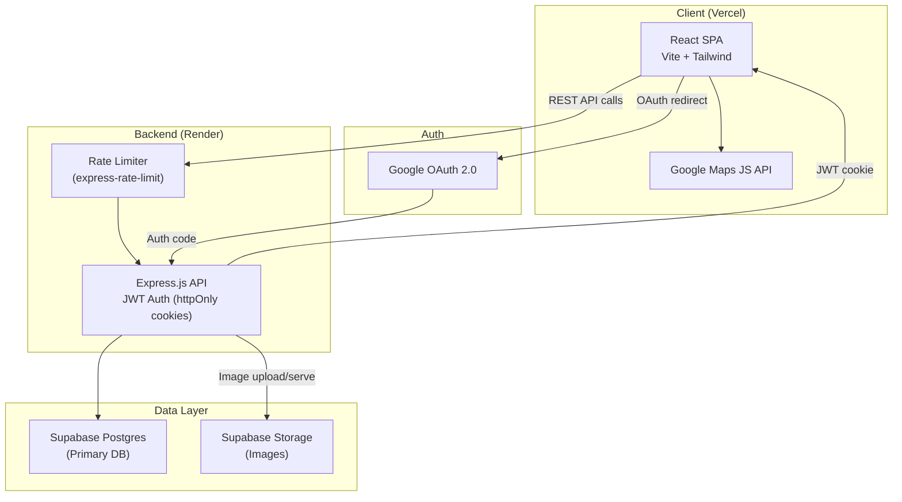
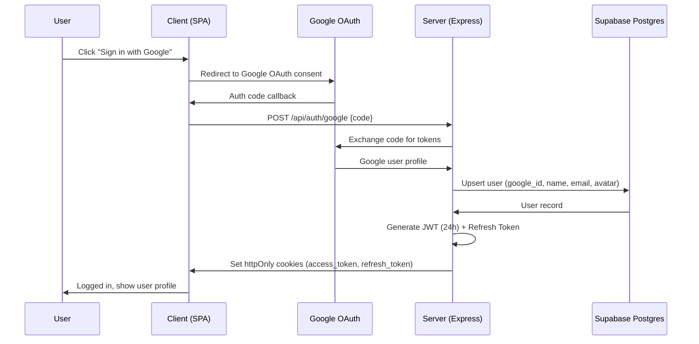
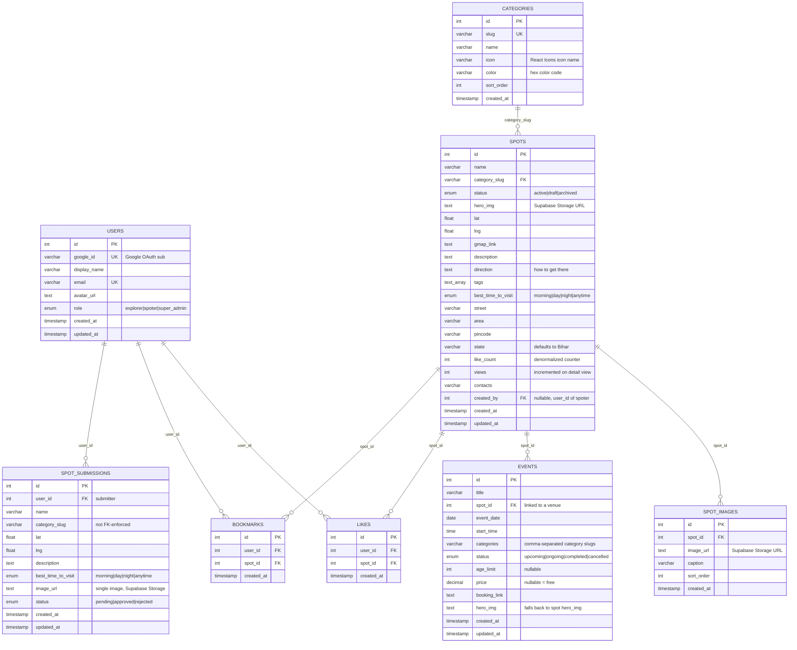
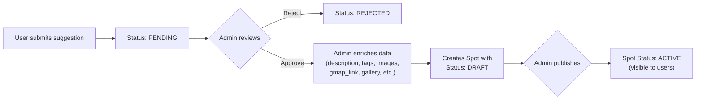

# SpotS (Patna) — Product Requirements Document v2.0

| | |
|---|---|
| **Product** | SpotS — Curated Patna City Discovery Platform |
| **Version** | 1.0 |
| **Last Updated** | 2026-10-03 |
| **Status** | Final Draft |

---

## 1. Executive Summary

SpotS is a **mobile-first, curated city-discovery web app** for Patna, Bihar. It combines an interactive map with hand-picked local spots (cafés, heritage sites, parks, riverfronts, markets, hidden gems), an authentic upvote-driven **HotSpots** leaderboard, a community suggestion pipeline, an events guide, and a full admin curation console — all designed to help people discover the best of Patna through local knowledge.

---

## 2. Product Vision & Core Commitments

1. **Authentic Rankings** — No star ratings. Ranking is driven purely by community likes (`like_count`) from verified (logged-in) users. This keeps rankings genuine and prevents drive-by spam.
2. **Mobile-First Tactile UX** — Centered mobile shell, spring-physics animations (Framer Motion), bottom sheets, responsive category filters. Desktop is fully supported but mobile is the primary design target.
3. **Curated Quality** — Every spot goes through admin review. Community suggestions are triaged, enriched, and published only when quality standards are met.
4. **Patna-Only** — The product is explicitly scoped to Patna. Multi-city is a non-goal.
5. **Integrated Admin Portal (`/admin`)** — Role-based curation console for managing spots, events, categories, submissions, and media — all within the same SPA.

---

## 3. Tech Stack

| Layer | Technology |
|---|---|
| **Frontend** | React 18 + JavaScript + Vite 6 + Tailwind CSS v3 |
| **Animations** | Framer Motion (`motion/react`) — spring physics, bottom sheets, page transitions |
| **Icons** | React Icons (multi-pack: Feather, Material, Phosphor, etc.) |
| **Map Engine** | Google Maps JavaScript API (API key in `.env`) |
| **Backend** | Node.js + Express.js (RESTful API) |
| **Database** | Supabase Postgres |
| **Image Storage** | Supabase Storage (S3-compatible buckets) |
| **Auth** | Custom Google OAuth 2.0 → server-issued JWT (httpOnly cookies) |
| **Dev Fallback** | `mockData.js` (local JSON when API unreachable in development only) |
| **Frontend Hosting** | Vercel (free tier) |
| **Backend Hosting** | Render (free tier) |
| **DB & Storage** |  Supabase (free tier) |

---

## 4. Users & Personas

| Persona | Role | Goals | Primary Surfaces |
|---|---|---|---|
| **Explorer** (consumer) | `explorer` | Discover authentic, curated spots; decide where to go *right now*; get directions; like & bookmark favorites | Map, Spots feed, HotSpots, Events, Suggest a Spot (FAB) |
| **Spoter** (contributor) | `spoter` | Add and edit their own spots via the admin console; contribute quality local knowledge | `/admin` console (limited: own spots only) |
| **Super Admin** | `super_admin` | Triage community submissions, publish/edit all spots, manage categories & events, manage media, view dashboard stats | `/admin` console (full access) |
| **Anonymous Visitor** | none | Browse the app, view spots/events/map. Cannot like, bookmark, or submit suggestions | Map, Spots feed, Events (read-only) |

### 4.1 Role Hierarchy & Permissions

| Action | Anonymous | Explorer | Spoter | Super Admin |
|---|---|---|---|---|
| Browse spots, map, events | ✅ | ✅ | ✅ | ✅ |
| Like / unlike a spot | ❌ | ✅ | ✅ | ✅ |
| Bookmark a spot | ❌ | ✅ | ✅ | ✅ |
| Suggest a spot | ❌ | ✅ | ✅ | ✅ |
| Admin: manage own spots | ❌ | ❌ | ✅ | ✅ |
| Admin: manage all spots | ❌ | ❌ | ❌ | ✅ |
| Admin: triage submissions | ❌ | ❌ | ❌ | ✅ |
| Admin: manage categories | ❌ | ❌ | ❌ | ✅ |
| Admin: manage events | ❌ | ❌ | ❌ | ✅ |
| Admin: media library | ❌ | ❌ | ❌ | ✅ |
| Admin: dashboard | ❌ | ❌ | ❌ | ✅ |

### 4.2 Account Provisioning

- **Explorers**: Self-register via Google OAuth on the app.
- **Spoters & Super Admins**: Manually provisioned by modifying the database directly (no User Management UI in v1).

---

## 5. System Architecture

### 5.1 API Design

**Pattern**: RESTful with resource-based routes. JWT auth via `Authorization` header or httpOnly cookie.

#### Public Endpoints (rate-limited: 100 req/min per IP)

| Method | Endpoint | Description |
|---|---|---|
| `GET` | `/api/spots` | List spots (paginated, filterable, searchable) |
| `GET` | `/api/spots/:id` | Get spot detail |
| `GET` | `/api/spots/hotspots` | Get top 10 spots by like_count |
| `GET` | `/api/categories` | List all active categories |
| `GET` | `/api/events` | List events (filterable by status) |
| `GET` | `/api/events/:id` | Get event detail |

#### Authenticated Endpoints (rate-limited: 10 req/min for writes)

| Method | Endpoint | Description |
|---|---|---|
| `POST` | `/api/auth/google` | Exchange Google auth code for JWT |
| `POST` | `/api/auth/refresh` | Refresh JWT using refresh token |
| `POST` | `/api/auth/logout` | Clear auth cookies |
| `GET` | `/api/auth/me` | Get current user profile |
| `POST` | `/api/spots/:id/like` | Like a spot (idempotent) |
| `DELETE` | `/api/spots/:id/like` | Unlike a spot |
| `GET` | `/api/bookmarks` | Get user's bookmarked spots |
| `POST` | `/api/bookmarks/:spotId` | Bookmark a spot |
| `DELETE` | `/api/bookmarks/:spotId` | Remove bookmark |
| `POST` | `/api/submissions` | Submit a spot suggestion |

#### Admin Endpoints (role-guarded)

| Method | Endpoint | Description |
|---|---|---|
| `GET` | `/api/admin/dashboard` | Dashboard stats |
| `GET/POST/PUT/DELETE` | `/api/admin/spots/*` | Full CRUD on spots |
| `GET/POST/PUT/DELETE` | `/api/admin/categories/*` | Full CRUD on categories |
| `GET/POST/PUT/DELETE` | `/api/admin/events/*` | Full CRUD on events |
| `GET/PUT` | `/api/admin/submissions/*` | Review & update submissions |
| `GET/DELETE` | `/api/admin/media/*` | Media library management |
| `POST` | `/api/admin/upload` | Upload image to Supabase Storage |

### 5.2 Authentication Flow

### 5.3 Rate Limiting

| Endpoint Type | Limit | Window |
|---|---|---|
| Public reads (`GET /api/*`) | 100 requests | per minute per IP |
| Writes (submissions, likes) | 10 requests | per minute per IP |
| Auth endpoints | 5 requests | per minute per IP |
| Admin endpoints | 50 requests | per minute per IP |

---

## 6. Data Model

`schema.sql` (workspace root) is the authoritative Postgres schema. Supabase Postgres is the primary database and storage provider.

### 6.1 Key Constraints

- `LIKES` has a **unique constraint** on `(user_id, spot_id)` — enforces idempotent likes.
- `BOOKMARKS` has a **unique constraint** on `(user_id, spot_id)`.
- `like_count` on `SPOTS` is a **denormalized counter** updated via application logic (increment on like, decrement on unlike).
- `SPOT_SUBMISSIONS.category_slug` is NOT FK-enforced to allow submissions with categories that may not yet exist.
- Events auto-expire: a scheduled job or query filter marks events as `completed` when `event_date` is past.

### 6.2 Canonical Category Taxonomy (Initial Seed)

| slug | name | icon (React Icons) | color |
|---|---|---|---|
| `cafes` | Cafés | `FiCoffee` | `#F97316` |
| `heritage` | Heritage | `MdTempleHindu` | `#8B5CF6` |
| `parks` | Parks | `FiTreePine` | `#10B981` |
| `ghat` | Ghats | `MdWater` | `#EC4899` |
| `shopping` | Bazaars | `FiShoppingBag` | `#F59E0B` |
| `secrets` | Secrets | `FiEye` | `#06B6D4` |

> **Note**: `all` is a synthetic pseudo-category injected client-side for "show everything" — never persisted. Categories are **admin-managed** and can be added/edited/deleted from the `/admin` console.

---

## 7. Functional Requirements

### 7.1 Navigation

- **Mobile**: Bottom tab bar with **4 tabs** — Map, Spots, Events, Profile.
- **Desktop**: Top navbar with the same 4 sections.
- **Persistent FAB**: A floating "+" button above the bottom tab bar on all tabs, opening the "Suggest a Spot" modal. Requires login to submit.
- **Routing**: React Router with the following routes:

| Route | Component | Auth Required |
|---|---|---|
| `/` | Map (default) | No |
| `/spots` | Spots Feed | No |
| `/spots/hotspots` | HotSpots Leaderboard | No |
| `/spot/:id` | Spot Detail (deep link) | No |
| `/events` | Events Grid | No |
| `/event/:id` | Event Detail (deep link) | No |
| `/profile` | User Profile | Yes |
| `/profile/bookmarks` | Saved Spots | Yes |
| `/admin/*` | Admin Console | Yes (spoter/super_admin) |

### 7.2 Map

- Full-bleed interactive Google Map centered on **Patna** (25.6120, 85.1400) at city-level zoom.
- **Custom pins**: Droplet-shaped SVG markers colored per category (`category.color`).
- **Pin animations**: Bouncy entrance animation; periodic subtle wiggle on the selected pin.
- **Tapping a pin**: Opens `MapBottomSheet` with spot preview.
- **Tapping empty map area**: Deselects the current spot, closes bottom sheet.
- **Floating controls**:
  - Top-left: Category filter dropdown (`MapCategoryDropdown`).
  - Bottom-right (stacked): Zoom in/out (web only), user location re-center, "Fit Patna" button (zooms to show all of Patna).
  - Controls fade/slide off-screen when the bottom sheet is open.

### 7.3 Map Bottom Sheet

- Slides up from the bottom with spring animation.
- Contents: Hero photo, like count (display only, no interaction), address, best time to visit, tags.
- **Actions**: "Get Directions" (opens `gmap_link` or constructed Google Maps directions URL), "View" (opens `SpotDetailModal`).

### 7.4 Spot Detail (Modal / Deep Link Page)

- Hero photo (with gallery carousel if multiple images).
- Category badge (colored), like count pill, full address, directions text, description, tags.
- **Actions**:
  - ❤️ **Like / Unlike** (requires login, idempotent).
  - 🔖 **Bookmark / Unbookmark** (requires login).
  - 🗺️ **Explore on Map** (navigates to Map tab, centers on this spot).
  - 📍 **Get Directions** (opens Google Maps).
  - 📤 **Share** (Web Share API with clipboard fallback; generates deep link URL `/spot/:id`).
- Increments `views` counter on open.
- Accessible via deep link at `/spot/:id`.

### 7.5 Spots Feed

- **Search**: Full-text search across `name`, `area`, `street`, `description`, `tags`, `category_slug`.
- **Filters**: Category, pincode, area, best time to visit.
- **Pagination**: Server-side, 10 cards per page, "Load More" button or infinite scroll.
- **HotSpots Banner**: A promotional card/badge at the top of the feed linking to the dedicated HotSpots leaderboard view.
- **Spot Card**: Hero image thumbnail, name, category badge, area, like count, "View" button.

### 7.6 HotSpots Leaderboard

- Accessible via the banner card at the top of Spots feed → opens a **dedicated full-screen leaderboard view** at `/spots/hotspots`.
- Top 10 spots ranked by `like_count` descending.
- Rank badges: 🥇 #1, 🥈 #2, 🥉 #3 with distinct styling; ranks 4–10 with numbered badges.
- Each entry shows: rank, hero image, name, category, area, like count.
- Tapping an entry opens `SpotDetailModal`.

### 7.7 Events

- **Default view**: Grid of upcoming and ongoing events.
- **Filter/tab**: Toggle to view past (completed/cancelled) events.
- **Auto-expire**: Events past their `event_date` are automatically marked `completed`.
- **Event Card**: Date/time, venue (spot name + area), category chips, price/free badge, age-limit badge, optional "Book Now" link.
- **Deep link**: Accessible at `/event/:id`.

### 7.8 Suggest a Spot

- **Trigger**: Persistent FAB ("+" button) on all tabs.
- **Requires login**: Tapping FAB as anonymous user prompts Google sign-in first.
- **Form** (fullscreen on mobile, centered modal on desktop):
  - Name (text, required)
  - Category (dropdown from active categories, required)
  - Location picker (embedded Google Map with draggable pin, pre-centered on Patna, required)
  - Description (textarea, required)
  - Best time to visit (dropdown: morning/day/night/anytime, required)
  - Image upload (single image, optional, uploaded to Supabase Storage)
- **Submit**: `POST /api/submissions` — shows success toast on success, error toast with retry on failure.
- Submission enters the admin triage queue with status `pending`.

### 7.9 Profile

- **Requires login**: Shows Google sign-in prompt for anonymous users.
- **Profile info**: Google avatar, display name, email (from OAuth).
- **Saved Spots**: List of bookmarked spots (links to `/profile/bookmarks`).
- **My Submissions**: List of user's spot suggestions with status (pending/approved/rejected).
- **Theme Toggle**: Light/dark mode switch. Light is default. Preference persisted in `localStorage`. Implemented via CSS custom properties for instant switching.
- **Logout**: Clears auth cookies.

---

## 8. Admin Console (`/admin`)

Route-guarded within the same React SPA. Accessible only to `spoter` and `super_admin` roles.

### 8.1 Admin Sections

| Section | Spoter Access | Super Admin Access |
|---|---|---|
| **Dashboard** | ❌ | ✅ Overview stats: total spots, pending submissions, active events, total users |
| **Spot Management** | ✅ Own spots only | ✅ All spots — CRUD, edit all fields, upload images, set status |
| **Submission Triage** | ❌ | ✅ View pending, review, enrich, approve → draft, reject |
| **Category Management** | ❌ | ✅ CRUD categories (name, slug, icon, color) |
| **Event Management** | ❌ | ✅ CRUD events, link to spots, set dates/status |
| **Media Library** | ❌ | ✅ Browse/manage all uploaded images |

### 8.2 Submission Triage Workflow

### 8.3 Spot Management Features

- **Create/Edit Form**: All `SPOTS` fields — name, category, description, direction, tags, address fields, best time to visit, contacts, gmap_link, lat/lng (via embedded Google Map with draggable pin), status.
- **Image Upload**: Hero image + multiple gallery images (sortable). Uploaded to Supabase Storage.
- **Status Control**: Active (visible), Draft (hidden, work-in-progress), Archived (soft-deleted).
- **Patna Landmark Presets**: Quick-select preset coordinates for well-known Patna landmarks to speed up spot creation.

---

## 9. Non-Functional Requirements

### 9.1 Performance

- **Mobile-first rendering**: Bottom-sheet/modal transitions use Framer Motion spring physics. Avoid layout thrash on iOS Safari (use `100dvh` / safe-area insets).
- **Skeleton loading**: Show skeleton placeholders for all data-fetching states (spots, events, map pins, admin tables).
- **Image optimization**: Serve appropriately sized images from Supabase Storage. Use lazy loading for images below the fold.
- **Bundle size**: Code-split the `/admin` routes so they're not loaded for regular users.

### 9.2 Offline & Error Resilience

- **Development**: API client falls back to `mockData.js` (small dataset mirroring the real schema) when the backend is unreachable.
- **Production**: Show skeleton loaders while fetching. On API failure, show a friendly "Connection issue" state with a retry button. No silent fallback to mock data.
- **Typed, fallback-safe API client**: Clean separation of public vs. admin API calls.

### 9.3 Accessibility

- Interactive icon-only buttons carry `aria-label` attributes.
- Proper heading hierarchy (single `<h1>` per page).
- Keyboard-navigable modals and bottom sheets.
- Sufficient color contrast ratios.

### 9.4 Security

- **No secrets in client bundles**: API keys (Google Maps) are restricted by domain. Database credentials and OAuth secrets are server-side only.
- **JWT in httpOnly cookies**: Prevents XSS token theft. 24h access token expiry with refresh token rotation.
- **Rate limiting**: `express-rate-limit` on all endpoints (see §5.3).
- **Input validation**: Server-side validation on all write endpoints.
- **CORS**: Restrict allowed origins to the Vercel frontend domain.
- **SQL injection prevention**: Use parameterized queries (Neon's `sql` tagged template literals or equivalent).

### 9.5 SEO & Discoverability

- Deep links (`/spot/:id`, `/event/:id`) render with proper `<title>` and `<meta description>` tags.
- Semantic HTML5 elements throughout.
- Open Graph tags for shared links (spot name, description, hero image).

---

## 10. Design System & UX Guidelines

### 10.1 Theme

- **Dual theme**: Light (default) and Dark. CSS custom properties for instant switching.
- **Persistence**: Theme preference stored in `localStorage`.
- **Color palette**: Curated, harmonious colors (not generic red/blue/green). Category colors are the primary accent palette.

### 10.2 Typography

- Modern Google Font (e.g., Inter, Outfit, or similar).
- Clear hierarchy: headings, body, captions.

### 10.3 Animations & Micro-interactions

- **Framer Motion** for all transitions: page enters, modal/bottom-sheet open/close, card hover effects.
- **Spring physics**: Bouncy, tactile feel on interactive elements.
- **Pin animations**: Entrance bounce, selected wiggle.
- **Skeleton shimmer**: Animated loading placeholders.
- **Like animation**: Heart burst/scale effect on like.

### 10.4 Data-Driven Category Styling

- `category.color` hex drives: map pin fill, category badge background, pill colors, filter chip accents.
- `category.icon` (React Icons component name) drives: map pin icon, badge icon, filter chip icon.

---

## 11. Do's and Don'ts

### ✅ Do's

| # | Rule |
|---|---|
| 1 | **Do use the established data model** — `schema.sql` is the single source of truth. Client types must mirror it exactly without legacy aliases. |
| 2 | **Do server-side paginate** — all list endpoints return paginated results (10 per page default). Never fetch entire tables client-side. |
| 3 | **Do validate on the server** — never trust client-side validation alone. All write endpoints validate inputs server-side. |
| 4 | **Do use parameterized queries** — prevent SQL injection. No string concatenation for SQL. |
| 5 | **Do code-split admin routes** — `/admin/*` routes should be lazy-loaded so consumers don't download admin code. |
| 6 | **Do use skeleton loading everywhere** — free-tier hosting means slow cold starts. Skeletons keep the UX feeling responsive. |
| 7 | **Do use CSS custom properties for theming** — enables instant theme switching without re-renders. |
| 8 | **Do keep the API client typed and fallback-safe** — separate public vs. admin API modules with graceful error handling. |
| 9 | **Do use httpOnly cookies for auth tokens** — never expose JWTs to JavaScript. |
| 10 | **Do use Framer Motion for all animations** — maintain consistent spring-physics feel across the app. |
| 11 | **Do use the category color/icon system** — all UI surfaces (pins, badges, filters) should derive styling from the category's `color` and `icon` fields. |
| 12 | **Do keep components focused and reusable** — follow single-responsibility principle. |
| 13 | **Do maintain proper error boundaries** — React error boundaries around major sections to prevent full-app crashes. |

### ❌ Don'ts

| # | Rule |
|---|---|
| 1 | **Don't store secrets in client bundles** — no API keys, DB credentials, or OAuth secrets in frontend code. Google Maps API key must be domain-restricted. |
| 2 | **Don't use localStorage for auth tokens** — use httpOnly cookies instead to prevent XSS token theft. |
| 3 | **Don't keep legacy field aliases** — remove duplicate backwards-compatibility aliases in client types. One name per field. |
| 4 | **Don't swallow errors silently** — show real feedback (success/error toasts) to users. No fake success states. |
| 5 | **Don't fetch all data client-side** — use server-side pagination, filtering, and search. |
| 6 | **Don't skip rate limiting** — all endpoints must be rate-limited via `express-rate-limit`. |
| 7 | **Don't hardcode categories** — categories are DB-driven and admin-managed. No hardcoded category lists in frontend code (except initial seed data for development). |
| 8 | **Don't use mock data in production** — `mockData.js` is development-only. Production must show proper loading/error states. |
| 9 | **Don't allow anonymous likes** — liking requires Google sign-in to prevent abuse. |
| 10 | **Don't skip input sanitization** — sanitize all user-provided HTML/text to prevent XSS. |
| 11 | **Don't use inline styles for theming** — use CSS custom properties and Tailwind classes. |
| 12 | **Don't create separate admin app** — admin is integrated at `/admin` within the same SPA, route-guarded by role. |
| 13 | **Don't add multi-city support** — Patna-only is a core product commitment for v1. |

---

## 12. Out of Scope (v1)

The following are explicitly **not** in v1:

| Feature | Notes |
|---|---|
| User comments/reviews on spots | Future consideration for community engagement |
| User-uploaded photos for existing spots | Community gallery is a v2 feature |
| Social features (follow users, activity feed) | Not aligned with curation-first philosophy |
| Spot recommendations (algorithmic) | Beyond v1 complexity |
| In-app messaging or chat | Not needed for discovery app |
| Analytics dashboard in admin | Stats dashboard (spot counts, etc.) is in scope; detailed analytics (trends, graphs) is not |
| Push notifications | No native app or service worker push |
| Native mobile app wrapper | Web-only for v1 |
| Payments/ticketing | Beyond an outbound `booking_link` on events |
| Multi-city support | Patna-only |
| User Management UI in admin | Roles managed via direct DB access |
| PWA (Progressive Web App) | Completely out of scope |

### 12.1 v2 Roadmap (Future Considerations)

| Feature | Priority |
|---|---|
| Multi-language support (Hindi/English) | High |
| Android native app | High |
| User comments/reviews | Medium |
| Community photo gallery | Medium |
| Admin analytics dashboard | Medium |
| User Management UI | Medium |
| Algorithmic recommendations | Low |

---

## 13. Glossary

| Term | Definition |
|---|---|
| **Spot** | A curated place/location in Patna listed on the platform |
| **HotSpots** | The top 10 spots ranked by community likes |
| **Explorer** | A regular logged-in user who browses, likes, and bookmarks |
| **Spoter** | A trusted contributor who can add their own spots via the admin panel |
| **FAB** | Floating Action Button — the persistent "+" button for suggesting spots |
| **Bottom Sheet** | A mobile UI pattern: a panel that slides up from the bottom of the screen |
| **Deep Link** | A URL that directly opens a specific spot or event (e.g., `/spot/42`) |
| **Triage** | The admin process of reviewing, enriching, and approving/rejecting community submissions |

---

## 14. Open Questions (Resolved)

| # | Question | Resolution |
|---|---|---|
| 1 | Final map engine decision? | **Google Maps JavaScript API** — $200/month free credit is sufficient |
| 2 | Should likes require login? | **Yes** — prevents abuse, enables unlike, backed by LIKES table |
| 3 | Deep-linking wanted? | **Yes** — `/spot/:id` and `/event/:id` with Web Share API |
| 4 | Where to store images? | **Supabase Storage** — S3-compatible, serves as image CDN |
| 5 | Auth provider? | **Custom Google OAuth** — self-managed, provider-agnostic |
| 6 | Frontend hosting? | **Vercel** (free tier) |
| 7 | Mock data in production? | **No** — dev-only fallback, production uses proper error states |
